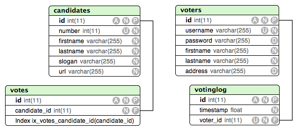

Database model
==============

The database model consists of four tables which divide into two logical
groups. The `candidates` and `votes` tables contain the candidate information
and associated votes. The `voters` and `votinglog` tables keep track of voters
and whether they have used their votes. The model explicitly **does not**
associate voters with the cast votes.

